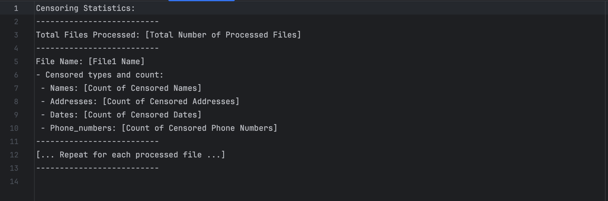

## Name: Manikumar Honnenahalli Lakshminarayana Swamy

## Project Description 
In this project, I developed a versatile censoring tool using data pipelines to effectively redact sensitive details 
such as names, dates, phones, and addresses within documents. My solution incorporates specific flags like --names, 
--dates, --phones, and --address, allowing users to specify entities for extraction and replacement with a unicode 
(U+2588). The tool provides detailed statistical summaries, supports diverse output options, and is tested using the 
Enron Email Dataset.

## How to install and run
1. Create a virtual environment with pipenv using: **'pipenv shell'**.
2. Install all dependencies specified in the Pipfile by running: **'pipenv install'**. This command downloads all required dependencies.
3. Run the application using: **'pipenv run python censoror.py --input {PATTERN} --names --dates --phones --address --output '{OUTPUT_FOLDER_PATH}' --stats {FILE/STDOUT/STDERR}'**.
4. To execute test cases and verify functionality, use the command: **'pipenv run python -m pytest'**.

## Functions
#### censoror.py
1. **'main()':** The main function serves as the entry point for the censoring tool. It utilizes the argparse module to parse command-line arguments for specifying input file patterns, censoring options (--names, --dates, --phones, --address), output folder, and statistics file or location. The function iterates through the specified input file patterns, loads spaCy and Google NLP credentials, and processes each file using the process_file function. It keeps track of file statistics such as the count of censored names, addresses, dates, and phone numbers.
2. **'process_file(input_file, arguments, nlp_instance, actual_file_name, original_text)':**  This method reads an input file, applies a multi-step censorship process using PyAP, Google NLP, and spaCy libraries to redact sensitive information, and writes the censored content to a new file in the specified output directory. It handles exceptions during processing and ensures the preservation of the original file name with the '.censored' extension..
3. **'censor_address_using_pyap(text, input_file_name, original_text)':** This function, censor_address_using_pyap, takes plain text and the name of the input file as parameters. It utilizes the PyAP library to identify and redact physical addresses (postal) within the text, replacing them with the Unicode full block character '\u2588'. The function maintains a count of the censored addresses in the statistics dictionary, specific to the input file.
4. **'censor_using_spacy(text, nlp, input_file_name, original_text)':** This function, censor_using_spacy, takes plain text, a spaCy natural language processing model (nlp), and the name of the input file as parameters. It utilizes spaCy to identify and redact sensitive entities, specifically names (labeled as 'PERSON') and dates (labeled as 'DATE'), by replacing them with the Unicode full block character '\u2588'. The function updates the statistics dictionary with the count of censored names and dates for the input file.
5. **'censor_using_google_nlp(text, input_file_name, original_text)':** This function, censor_using_google_nlp, takes plain text and the name of the input file as parameters. Leveraging the Google Cloud Natural Language Processing (NLP) API, it identifies and redacts sensitive entities, such as locations, phone numbers, dates, and names, replacing them with the Unicode full block character '\u2588'. The function updates the statistics dictionary with the count of censored addresses, phone numbers, dates, and names for the input file.
6. **'load_google_nlp_cred()':** This function, load_google_nlp_cred, attempts to load Google Cloud Natural Language Processing (NLP) credentials from the specified service account JSON file. It uses the service_account module to create credentials and initializes a global client for the LanguageService.
7. **'write_data_to_stats(stats, files_count)':** This function, write_data_to_stats, takes a statistics dictionary and the total file count as parameters, and writes the censorship statistics to either stderr, stdout, or a specified file. If the stats parameter is set to "stderr" or "stdout," it writes the statistics to the respective standard output streams. Otherwise, it creates and writes a file with the provided filename. The statistics include the total number of processed files and the count of censored types (names, dates, addresses, phone numbers) for each file. 

## Output Format

#### Explanation:
    - Total Files Processed: Indicates the overall number of processed files.   
    - File Name: Specifies the name of each processed file.
    - Censored types and count: Breaks down the censorship by different entity types, including Names, Addresses, Dates, and Phone Numbers.
    - Names: Number of names censored in the file.
    - Addresses: Number of addresses censored in the file.
    - Dates: Number of dates censored in the file.
    - Phone_numbers: Number of phone numbers censored in the file.

## Test Cases
#### test_download.py
1. **test_censor_using_google_nlp():** This test validates the censor_using_google_nlp method by inputting a text with personal information and ensuring that the Google NLP-based censorship produces the expected redacted output. The test also initializes statistics to track relevant metrics during the censorship process.
2. **test_censor_using_spacy():** This test assesses the functionality of the censor_using_spacy method, focusing on redacting personal information within a given text using the Spacy natural language processing library. The test includes loading the Spacy model, providing an input text, initializing statistics, and verifying that the censorship produces the expected output.
3. **test_censor_address_using_pyap():** This test ensures the accurate functioning of the censor_address_using_pyap method, specifically focusing on redacting addresses within a given text using the PyAP (Python Address Parser) library. The test involves providing an input text containing an address, initializing statistics, and verifying that the censorship results in the expected output.
4. **test_write_data_to_stats_stderr():** This test verifies the correctness of the write_data_to_stats method when writing censorship statistics to the standard error stream (stderr). The test captures the stderr output, initializes sample censorship statistics, and ensures that the expected formatted output is generated for a given file count and statistics dictionary.
5. **test_process_file_creates_output_file():** This test ensures that the process_file method correctly processes an input file, applying censorship based on specified criteria (names, dates, phones, address), and creates an output file with the ".censored" extension. The test cleans up any existing output files, sets up the necessary arguments, loads required libraries, and validates the presence of the expected censored output file after processing.

## Bugs and Assumptions
#### Bugs
1. **Service Key Security:** Storing the Google NLP service key in a file might pose security risks. Consider providing guidelines on securing and managing sensitive credentials.
2. **Spacy Misclassifies Non-Person Terms as Persons:** Spacy may erroneously recognize non-person entities as persons, leading to inaccurate entity labeling in certain scenarios.

#### Assumptions
1. **Address Censoring:** The current implementation assumes that censor_address_using_pyap effectively captures and redacts all addresses. If there are limitations or specific address formats it might not handle, this should be documented.
2. **Whitespace Censoring Assumption:** The decision to censor both words and whitespaces is assumed.
3. **Format Consistency Assumption:**  Inconsistent or non-standard formats of phone numbers and addresses might lead to potential misidentification or failure of recognition by PyAP and Google NLP.
